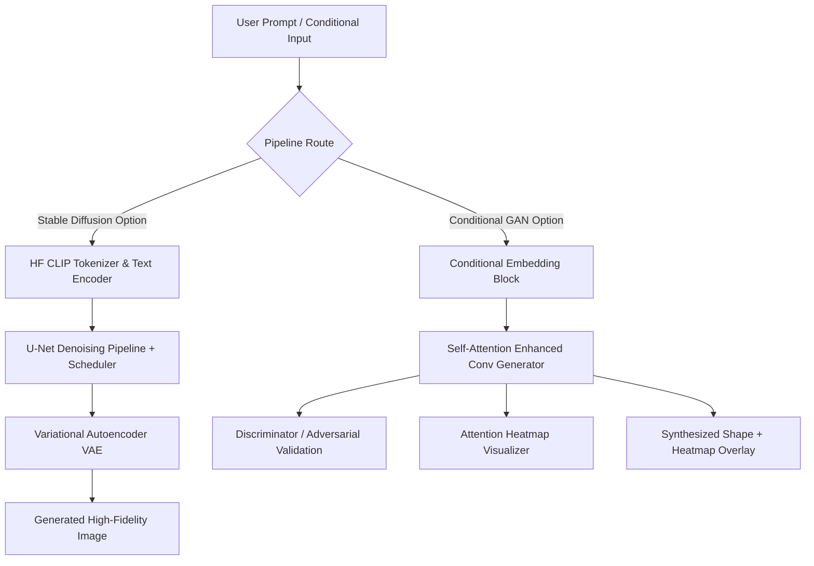

# Educational Text-to-Image Generation & Latent Diffusion Web Suite

An end-to-end educational and experimental platform for text-conditioned visual generation. Built as a dual-paradigm suite, it integrates pre-trained **Latent Diffusion Models (Stable Diffusion)** alongside custom **Conditional Generative Adversarial Networks (CGAN)**, complete with Natural Language Processing (NLP) tokenization interfaces, self-attention layers, and exploratory dataset profiling.

Developed as a unified, highly optimized portfolio application during the Elevanceskill Internship.

---

## 🚀 Core Project Features

1. **Pre-trained Latent Diffusion Suite**
   - Integrates **Stable Diffusion 1.5**, **Stable Diffusion 2.1**, and **Realistic Vision XL** models.
   - Built-in VRAM optimizations: Attention/VAE slicing, CPU offloading, and dynamic scheduler swapping (Euler Ancestral, Euler, DDIM, DPM Solver, LMS) on the fly.
   - Refined and adapted to support custom stylization adapters (LoRA checkpoints).

2. **Conditional Generative Adversarial Networks (CGAN)**
   - Custom-engineered PyTorch generator and discriminator models designed to synthesize geometric visual assets (circle, square, triangle) directly from conditional text labels.
   - Employs binary cross-entropy (BCE) adversarial loss formulations balanced dynamically.

3. **Self-Attention & Evolutionary Attention Mapping**
   - Custom PyTorch attention blocks incorporated inside GAN convolutional pipelines to improve boundary sharpness and pixel-level convergence.
   - Interactive, color-coded visual heatmaps overlaying real-time attention weight distributions onto generated assets.

4. **Text Preprocessing & Embedding Engine**
   - Software leveraging Hugging Face's `transformers` library (`CLIPTokenizer` and `CLIPTextModel`) to clean, tokenize, and encode prompts.
   - Visual NLP interface showing token IDs, attention masks, and 2D spatial projections of high-dimensional text embeddings.

5. **Exploratory Dataset Profiling**
   - Built-in data loading and statistical profiling dashboard designed to load public image-caption datasets (like Oxford-102 Flowers).
   - Reports class distribution frequency, average caption lengths, resolution variations, and visualizes paired text-image samples.

6. **Unified Gradio Web Application**
   - A highly responsive, multi-tab web dashboard unifying the Stable Diffusion pipeline, CGAN shape synthesizer, dataset analysis tools, and tokenization visualizations.

---

## 🛠️ Setup & Installation

### 1. Clone & Navigate
```bash
git clone https://github.com/pritpatel2412/Text-to-Image-.git
cd Text-to-Image-
```

### 2. Configure Virtual Environment
```bash
python -m venv venv
# Windows:
venv\Scripts\activate
# Linux/macOS:
source venv/bin/activate
```

### 3. Install Dependencies
```bash
pip install -r requirements.txt
```

### 4. Running Tests
To verify the installation and the basic functionality of the generative models and pipeline routing, run the test script:
```bash
python -m unittest test_models.py
```

---

## 📐 Project Architecture



---

## 📅 Roadmap & Milestones (6-Week Timeline)

* **Weeks 1-2**: Public Dataset Exploratory Analysis & Text Preprocessing/CLIP Embedding Extraction pipelines.
* **Weeks 3-4**: Custom Conditional GAN (CGAN) Shape Synthesizer design, synthetic training data pipeline, and training loop.
* **Weeks 5-6**: Self-Attention & Cross-Attention block integration (SAGAN) and Stable Diffusion fine-tuning experiments (LoRA).
* **Weeks 7-8**: Unified Pipeline Engine Integration, Gradio Multi-tab layout configuration, and VRAM memory profiling.
* **Week 9**: Final testing, portfolio documentation, and compiled report packaging.

---

## 📄 License
This project is developed for educational and internship evaluation purposes under Elevanceskill. All rights reserved.
